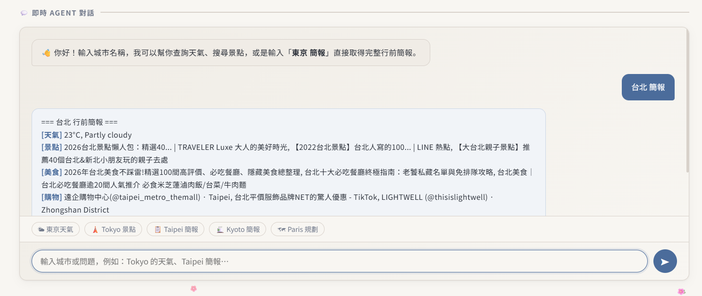
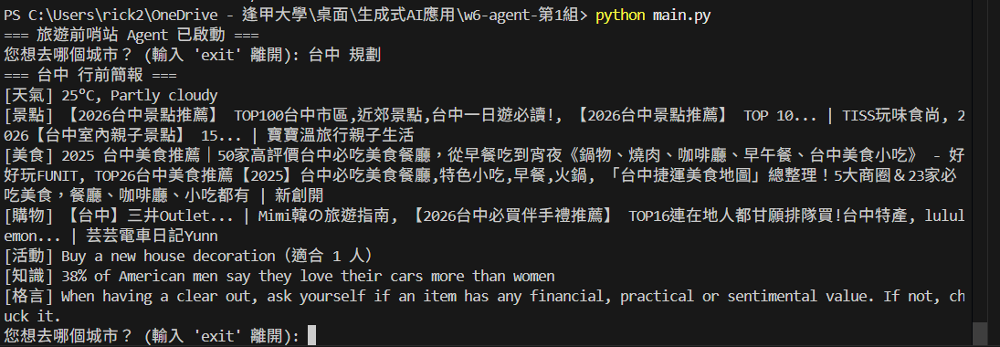

# AI agent 開發分組實作

> 課程：AI agent 開發 — Tool 與 Skill
> 主題： 旅遊前哨站

---

## Agent 功能總覽

> 使用者輸入城市名稱或關鍵字，Agent 會自動判斷意圖並呼叫對應工具，或執行完整行前簡報 Skill。

| 使用者輸入          | Agent 行為                                              | 負責組員 |
| ------------------- | ------------------------------------------------------- | -------- |
| `[城市] 的天氣`     | 呼叫 `weather_tool`，查詢即時溫度與天氣描述             | 黃柏豪   |
| `[城市] 景點推薦`   | 呼叫 `search_tool`，以 DuckDuckGo 搜尋景點              | 黃柏豪   |
| `[城市] 美食 / 購物`| 呼叫 `search_tool`，搜尋美食或購物推薦                  | 黃柏豪   |
| `[城市] 簡報 / 規劃`| 執行 `trip_briefing` Skill，產出完整行前簡報            | 黃柏豪   |

---

## 組員與分工

| 姓名   | 負責功能              | 檔案                          | 使用的 API                        |
| ------ | --------------------- | ----------------------------- | --------------------------------- |
| 黃柏豪 | 天氣查詢 Tool         | `tools/weather_tool.py`       | wttr.in                           |
| 黃柏豪 | 景點／美食／購物搜尋 Tool | `tools/search_tool.py`    | DuckDuckGo (ddgs)                 |
| 黃柏豪 | 冷知識、格言、活動 Tool | `tools/fun_facts_tool.py`   | Useless Facts / Advice Slip / Bored API |
| 黃柏豪 | Skill 整合            | `skills/trip_briefing.py`     | —                                 |
| 黃柏豪 | Agent 主程式 + Web 伺服器 | `main.py` / `app.py`      | Gemini API (google-genai)         |

---

## 專案架構

```
├── tools/
│   ├── weather_tool.py      # 天氣查詢（wttr.in）
│   ├── search_tool.py       # DuckDuckGo 搜尋（景點/美食/購物）
│   └── fun_facts_tool.py    # 冷知識、格言、活動建議
├── skills/
│   └── trip_briefing.py     # 行前簡報 Skill（整合所有 Tool）
├── app.py                   # Flask Web 伺服器（提供 dashboard.html + /api/chat）
├── main.py                  # 命令列版 Agent 主程式
├── dashboard.html           # AI Agent 架構儀表板（含即時對話介面）
├── requirements.txt
└── README.md
```

---

## 使用方式

### 方式一：命令列模式

```bash
# 建立虛擬環境（選用）
python -m venv .venv
.venv\Scripts\activate       # Windows
# source .venv/bin/activate  # macOS/Linux

# 安裝套件
pip install -r requirements.txt

# 設定 API Key（.env 檔）
# 內容：GEMINI_API_KEY=你的金鑰

# 執行
python main.py
```

### 方式二：Web Dashboard 模式

```bash
python app.py
# 開啟瀏覽器前往 http://localhost:5000
```

---

## 執行結果

```
=== 旅遊前哨站 Agent 已啟動 ===
您想去哪個城市？ (輸入 'exit' 離開): 台中 規劃
=== 台中 行前簡報 ===
[天氣] 25°C, Partly cloudy
[景點] 【2026台中景點推薦】 TOP100台中市區,近郊景點,台中一日遊必讀!, 【2026台中景點推薦】 TOP 10... | TISS玩味食尚, 2026【台中室內親子景點】 15... | 寶寶溫旅行親子生活
[美食] 2025 台中美食推薦｜50家高評價台中必吃美食餐廳，從早餐吃到宵夜《鍋物、燒肉、咖啡廳、早午餐、台中美食小吃》 - 好好玩FUNIT, TOP26台中美食推薦【2025】台中必吃美食餐廳,特色小吃,早餐,火鍋, 「台中捷運美食地圖」總整理！5大商圈＆23家必 吃美食，餐廳、咖啡廳、小吃都有 | 新創開
[購物] 【台中】三井Outlet... | Mimi韓の旅遊指南, 【2026台中必買伴手禮推薦】 TOP16連在地人都甘願排隊買!台中特產, lululemon... | 芸芸電車日記Yunn
[活動] Buy a new house decoration（適合 1 人）
[知識] 38% of American men say they love their cars more than women
[格言] When having a clear out, ask yourself if an item has any financial, practical or sentimental value. If not, chuck it.
您想去哪個城市？ (輸入 'exit' 離開): 
```



UI 介面



命令列介面

---

## 各功能說明

### 天氣查詢（負責：黃柏豪）

- **Tool 名稱**：`get_weather`
- **使用 API**：[wttr.in](https://wttr.in/) — 免費，無需 API Key
- **輸入**：`city`（城市名稱，如 `Tokyo`）
- **輸出範例**：`16°C, Clear`

```python
TOOL = {
    "name": "get_weather",
    "description": "查詢目的地的即時天氣資訊",
    "parameters": {
        "type": "object",
        "properties": {
            "city": {"type": "string", "description": "城市名稱，例如：Tokyo"}
        },
        "required": ["city"]
    }
}
```

### 景點／美食／購物搜尋（負責：黃柏豪）

- **Tool 名稱**：`search_attractions`
- **使用 API**：[DuckDuckGo](https://pypi.org/project/ddgs/) — 免費，無需 API Key
- **輸入**：`query`（搜尋關鍵字，如 `Tokyo 景點`、`Taipei 必吃美食`）
- **輸出範例**：`東京鐵塔, 淺草寺, 明治神宮`

### 冷知識、格言與活動建議（負責：黃柏豪）

- **Tool 名稱**：`get_travel_fact` / `get_motto` / `get_activity`
- **使用 API**：
  - [Useless Facts](https://uselessfacts.jsph.pl/) — 隨機冷知識
  - [Advice Slip](https://api.adviceslip.com/) — 人生格言
  - [Bored API](https://bored-api.appbrewery.com/) — 隨機活動建議
- **輸入**：無
- **輸出範例**：`A snail can sleep for 3 years.` / `Enjoy your trip.` / `Go for a walk（適合 1 人）`

### Skill：trip_briefing（負責：黃柏豪）

- **組合了哪些 Tool**：`get_weather`、`search_attractions`（×3）、`get_travel_fact`、`get_motto`、`get_activity`
- **執行順序**：

```
Step 1: 呼叫 weather_tool(city)       → 取得即時天氣
Step 2: 呼叫 search_tool(城市 景點)   → 取得熱門景點
Step 3: 呼叫 search_tool(城市 美食)   → 取得必吃美食
Step 4: 呼叫 search_tool(城市 購物)   → 取得購物推薦
Step 5: 呼叫 fun_facts_tool           → 取得活動、冷知識、格言
Step 6: 組合輸出                      → 產生格式化行前簡報
```

---

## 心得

### 遇到最難的問題

> 寫下這次實作遇到最困難的事，以及怎麼解決的

#### 黃柏豪
1. **Gemini 429 錯誤**

    Gemini 在 API KEY 上的調用有流量限制，針對特定模型像是 gemini-2.5-flash-lite，這會導致在執行 Skill 時，如果 Tool 的調用次數超過限制，就會出現 429 錯誤。

    最初的解法是我自行更換其他 API KEY，後來發現可以透過更換模型來解決這個問題，因此我將原本的 gemini-2.5-flash-lite 更換成 gemini-2.5-flash，雖然速度變慢，但可以避免 429 錯誤。

2. **整合Skill 和 Tool**

    在初次的 Merge 之後，首先出現的是第一點的錯誤，接者是 Search_Tool 並沒有正確回傳查詢到的資訊，經過除錯後，發現是因為回傳的格式與接收格式不一致，因此需要調整。

    但最後搜尋到的資訊，只是單純的列出名稱或者網站的標題，並沒有篩選並整理成有用的資訊，因此需要再調整。

### Tool 和 Skill 的差別

> 用自己的話說說，做完後你怎麼理解兩者的不同

#### 黃柏豪
Tool 是專門處理單一任務的工具，像是數學中的一道公式，它不會適配所有問題，或者僅能處理單一面向的問題，因此你得知道它應該用在何處。而 Skill 就像是將多個 Tool 組合起來，用多個公式與觀念解決一道數學難題。

### 如果再加一個功能

> 如果可以多加一個 Tool，你會加什麼？為什麼？

#### 黃柏豪

我想我會新增過濾資訊的 Tool，因為目前搜尋到的資訊通常會包含一些不相關的內容，因此需要再過濾，或者可以再新增一個 Tool，將搜尋到的資訊整理成有用的資訊，讓使用者可以針對特定的資訊進行深度篩選與整理。

例如: 在閱讀完旅遊地區的簡報後，可以針對單一項的資料再次進行搜尋。而 Agent 也以此反饋多種選項讓使用者進行選擇。